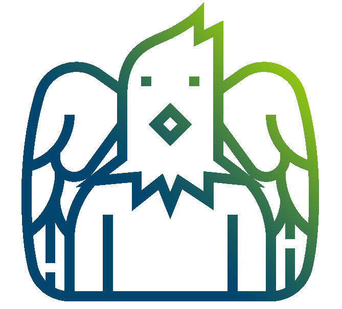
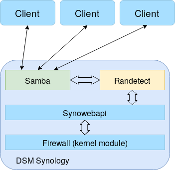

[![Issues][issues-shield]][issues-url]

[![GPL2 License][license-shield]][license-url]


[![LinkedIn][linkedin-shield]][linkedin-url]


<br />
<p align="center">
  <a href="https://github.com/CIL-Lamballe/Randetect">
    
  </a>

  <h1 align="center">Randetect</h1>

  <p align="center">
    A user suspicious activity detector for Synology NAS.
    <br />
    <a href="https://github.com/CIL-Lamballe/Randetect"><strong>Explore the docs »</strong></a>
    <br />
    <br />
    <a href="https://github.com/CIL-Lamballe/Randetect">View Demo</a>
    ·
    <a href="https://github.com/CIL-Lamballe/Randetect/issues">Report Bug</a>
    ·
    <a href="mailto:contact@cil-lamballe.com">Request Feature</a>
  </p>
</p>


## Table of Contents

* [About the Project](#about-the-project)
  * [Built With](#built-with)
* [Getting Started](#getting-started)
  * [Prerequisites](#prerequisites)
  * [Installation](#installation)
* [Usage](#usage)
* [Roadmap](#roadmap)
* [Contributing](#contributing)
* [License](#license)
* [Contact](#contact)
* [Acknowledgements](#acknowledgements)


## About The Project

There are plenty of users that sometimes does not manipulate files properly. They corrupt file system hierarchy which disrupts production.

This project is an attempt for monitoring abnormal activities on Synology Network Attached Storage. It aims at performing appropriate response to user activities from log analysis.

Randetect is a deamon monitoring the changes made to the filesystem by samba clients. It filters user log using a customizable set of rules. Depending on criticity, randetect will:

* ban the IP performing illegal actions,

* power off the NAS in order to prevent spread - in case of a ransomware.

Direct changes made to the file system are not monitored i.e. activity perfomed through ssh...

<figure class="workflow">
  
  <figcaption><i><b>(General architecture including Randetect)</i></b></figcaption>
</figure>

Randetect performs analysis on queries from Samba logs generated by the default Synology Log Center.


### Built With

Randetect is build as a "static binary", this helps to prevent runtime issues.

The `build.sh` script builds `randetect` into 2 architectures using [Cross](https://github.com/rust-embedded/cross).

| Architecture  | Synology NAS Model               |  Binary name           |
| ------------- | -------------------------------- | ---------------------- |
| aarch64       | DS418...                         | randetect_aarch64-musl |
| x86_64        | RS814RP+, RS815RP+, RS818RP+...  | randetect_x86_64-musl  |

In order to build randetect binaries, execute `./build.sh` in the Randetect's repository.


## Getting Started

The following instructions will help setting up your project on a local Linux distro.

To get a local copy up and running follow these simple example steps.

### Prerequisites

Software needed and how to install them.
* Rust
```sh
curl --proto '=https' --tlsv1.2 -sSf https://sh.rustup.rs | sh
```
* Docker
<p>Please follow instruction on official Docker website <a href="https://docs.docker.com/engine/install/">here</a>.
</p>

* Cross
<p>Please follow instruction on official Corss github repository <a href="https://github.com/rust-embedded/cross">here</a>.
</p>

### Installation

Installation can be tricky as Randetect has not been developed as a DSM Synology package.
It requires the following steps in order for it to properly run on a system.

1. After following the [Prerequisites](#prerequisites), build binaries using:
```sh
chmod +x build.sh && ./build.sh
``` 

2. Enable ssh connection on your NAS.

3. From your workstation, send the appropriate randetect binary to your NAS slash root directory using the following command:
```sh
scp -P <ssh_port> randetect_<archi> admin@<NAS_IP>:/root
```

4. Connect with ssh to your NAS.

5. Execute `randetect` with your environment variables -  refer to [Usage](#usage):
```sh
CRDTL=ABCDEFGHIJ01234567 TARGETSYS=62.186.103.42 FOLDER=/var/log/sms MAILTO="addr@domain.com" ./randetect_<archi>
```


## Usage

In order to run the program, some env variables needs to be set.

`CRDTL=ABCDEFGHIJ01234567` where the 10 first bytes are the sms system username and the 8 last bytes are the password.

`TARGETSYS=62.186.103.42` ip or domain of the targeted machine.

`FOLDER=/var/log/sms` target folder to send sms file to.

`MAILTO=addr@domain.com` mail target for mail alert.

Example:

```sh
CRDTL=ABCDEFGHIJ01234567 TARGETSYS=62.186.103.42 FOLDER=/var/log/sms MAILTO="addr@domain.com" ./randetect
```


## Roadmap

See the [open issues](https://github.com/CIL-Lamballe/Randetect/issues) for a list of proposed features (and known issues).


## Contributing

Contributions are what make the open source community such an amazing place to be learn, inspire, and create. Any contributions you make are **greatly appreciated**.

1. Fork the Project
2. Create your Feature Branch (`git checkout -b feature/AmazingFeature`)
3. Commit your Changes (`git commit -m 'Add some AmazingFeature'`)
4. Push to the Branch (`git push origin feature/AmazingFeature`)
5. Open a Pull Request


## License

Distributed under the GPL2 License. See `LICENSE` for more information.


## Contact

CIL Lamballe - [@cil_lamballe](https://twitter.com/cil_lamballe) - contact@cil-lamballe.com

Project Link: [https://github.com/CIL-Lamballe](https://github.com/CIL-Lamballe)


## Acknowledgements
* [Ant0wan](https://github.com/Ant0wan)


[contributors-shield]: https://img.shields.io/github/contributors/CIL-Lamballe/Randetect?style=flat-square
[contributors-url]: https://github.com/CIL-Lamballe/Randetect/graphs/contributors
[forks-shield]: https://img.shields.io/github/forks/CIL-Lamballe/Randetect.svg?style=flat-square
[forks-url]: https://github.com/CIL-Lamballe/Randetect/network/members
[issues-shield]: https://img.shields.io/github/issues/CIL-Lamballe/Randetect
[issues-url]: https://github.com/CIL-Lamballe/Randetect/issues
[license-shield]: https://img.shields.io/badge/license-GPL%20(%3E%3D%202)-blue
[license-url]: https://github.com/CIL-Lamballe/Randetect/LICENSE
[linkedin-shield]: https://img.shields.io/badge/-LinkedIn-black.svg?style=flat&logo=appveyor&logo=linkedin&colorB=555
[linkedin-url]: https://www.linkedin.com/company/cil-lamballe
